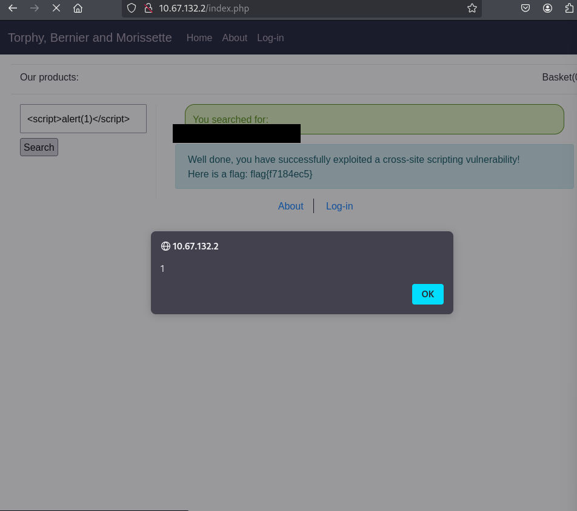
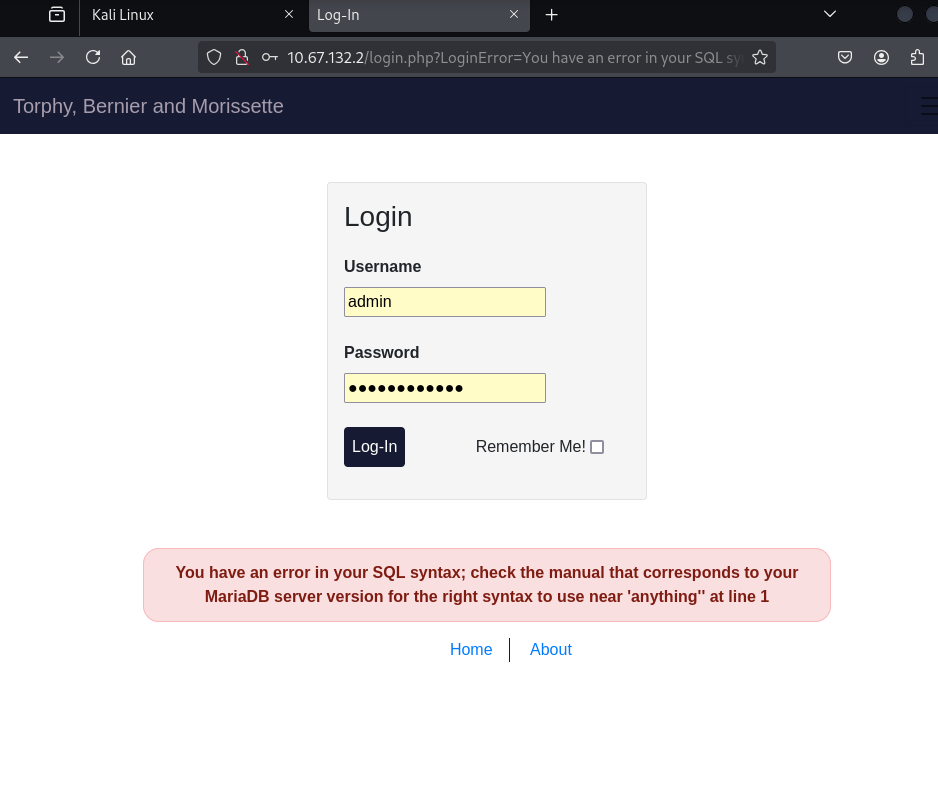
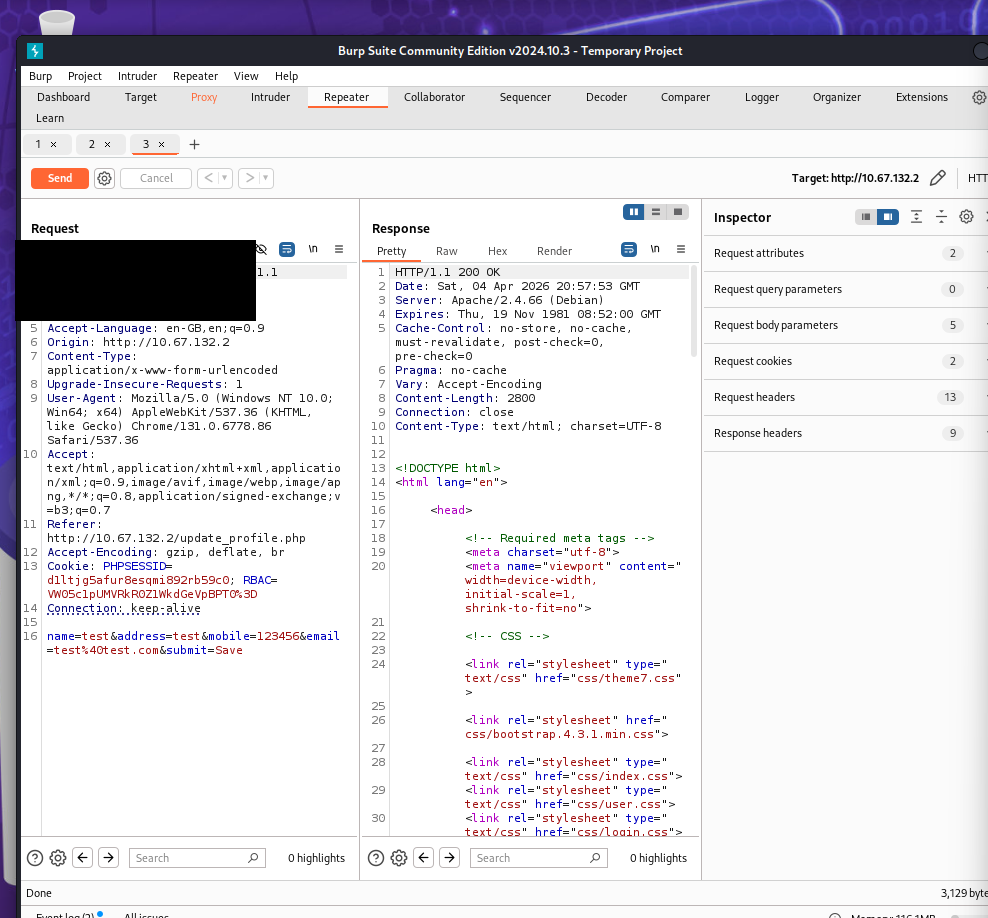
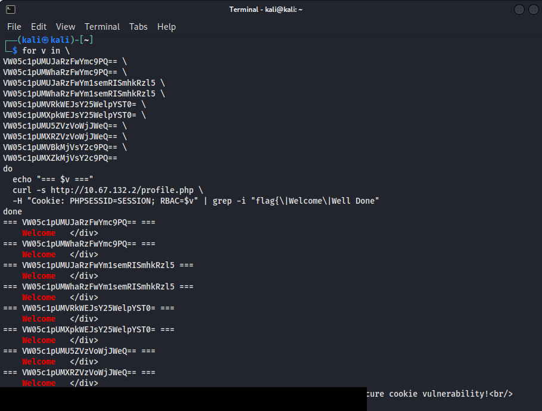
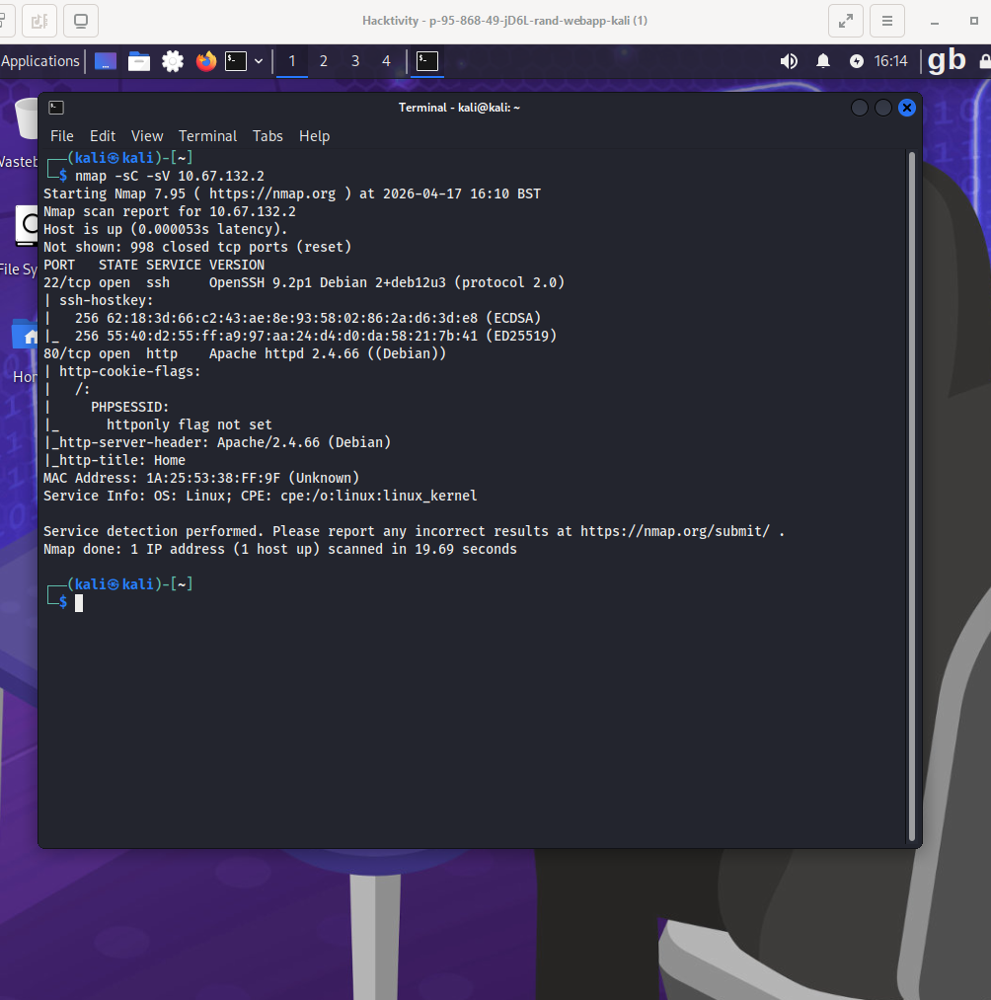

# Web Application Penetration Test

## Overview

This project documents a penetration test performed against an intentionally vulnerable web application within an authorised Hacktivity cybersecurity lab environment.

The objective was to identify and investigate common web application vulnerabilities using manual testing and security tools. Testing identified vulnerabilities including reflected Cross-Site Scripting (XSS), SQL Injection, and broken access control caused by insecure client-side role management.

The project demonstrates a structured approach to web application security testing, from reconnaissance and vulnerability identification through controlled exploitation, evidence collection, risk analysis, and remediation.

---

## Scope

Testing was restricted to the intentionally vulnerable web application provided within the authorised Hacktivity cybersecurity lab environment.

No external or production systems were targeted.

The purpose of the assessment was to develop practical penetration-testing skills in a safe and controlled environment.

---

## Tools Used

- Kali Linux
- Burp Suite Community Edition
- Nmap
- sqlmap
- Web browser
- Linux command-line tools

---

## Testing Methodology

The assessment followed a structured penetration-testing process:

1. Reconnaissance and service enumeration
2. Application mapping and manual testing
3. HTTP request inspection using Burp Suite
4. Vulnerability identification
5. Controlled exploitation
6. Evidence collection
7. Risk analysis
8. Remediation recommendations

---

# Findings

## 1. Reflected Cross-Site Scripting (XSS)

### Description

Testing identified a reflected Cross-Site Scripting vulnerability within the application's search functionality.

User-controlled input was returned to the page without sufficient sanitisation or output encoding.

A controlled JavaScript payload executed successfully in the browser, confirming that arbitrary client-side JavaScript execution was possible.

### Evidence

The search functionality was tested using a controlled JavaScript payload.

The application reflected the supplied input into the resulting page and the JavaScript executed within the browser.

This demonstrated that the application did not sufficiently protect the output from user-controlled input.

### Screenshot Evidence

### Potential Impact

Successful exploitation of a reflected XSS vulnerability could potentially allow an attacker to:

- Execute malicious JavaScript in a victim's browser
- Manipulate displayed web content
- Perform phishing attacks
- Perform actions within a user's authenticated session
- Potentially access sensitive browser-accessible information

### Recommended Remediation

- Apply context-aware output encoding
- Validate user-controlled input
- Implement an appropriate Content Security Policy (CSP)
- Avoid inserting untrusted input directly into executable browser contexts
- Use secure development frameworks that provide automatic output encoding where appropriate

---

## 2. SQL Injection

### Description

Testing of the application's authentication functionality identified SQL Injection behaviour.

The application returned detailed database errors containing MariaDB information when specially crafted input was submitted.

Further controlled testing demonstrated that user input could influence database queries.

### Investigation

The SQL Injection vulnerability was investigated by:

1. Identifying database error behaviour
2. Determining the number of columns used by the affected query
3. Testing UNION-based SQL Injection
4. Enumerating database tables
5. Identifying columns within the affected database
6. Demonstrating access to information stored within the lab database
7. Demonstrating authentication bypass and access to an administrative account within the lab environment

Manual testing and sqlmap were used during the investigation.

### Screenshot Evidence

### Potential Impact

SQL Injection vulnerabilities can have a significant impact on an application.

Depending on database permissions and application configuration, successful exploitation could potentially result in:

- Unauthorised access to application data
- Authentication bypass
- Disclosure of sensitive information
- Modification or deletion of database information
- Access to privileged application functionality
- Wider system compromise in severely misconfigured environments

### Recommended Remediation

- Use parameterised queries and prepared statements
- Validate user-controlled input
- Apply least-privilege database permissions
- Avoid dynamically constructing SQL queries using user input
- Do not expose detailed database error messages to users
- Log and monitor suspicious database requests

---

## 3. Broken Access Control / Insecure RBAC Cookie

### Description

Testing identified an access-control weakness involving the application's Role-Based Access Control (RBAC) cookie.

Role information used by the application was stored within a client-controlled cookie.

The role value was encoded but could be decoded and modified by the user.

### Investigation

Testing demonstrated that the cookie contained role information representing the user's level of access.

The encoded value was modified to represent an alternative role and was then supplied back to the application.

The server trusted the manipulated client-side role information.

This resulted in elevated access within the authorised lab environment.

### Screenshot Evidence

### Potential Impact

If an application trusts client-controlled role information, an attacker may be able to modify their assigned privileges.

This could potentially result in:

- Privilege escalation
- Access to restricted functionality
- Unauthorised access to sensitive information
- Modification of protected application data
- Administrative functionality being exposed to unauthorised users

### Recommended Remediation

- Enforce all authorisation decisions on the server side
- Never trust client-controlled role information
- Associate permissions with authenticated server-side sessions
- Protect session information using cryptographically secure mechanisms
- Verify user permissions for every privileged request
- Implement proper Role-Based Access Control on the server

---

# Reconnaissance

Nmap was used within the authorised lab environment to identify available network services associated with the target.

The reconnaissance stage helped establish the application's attack surface before more detailed web application testing was performed.

Information collected during reconnaissance was used to guide subsequent testing.

### Screenshot Evidence

---

# HTTP Request Analysis

Burp Suite Community Edition was used to inspect HTTP communication between the browser and the vulnerable web application.

This allowed requests and responses to be examined during testing and helped identify how user-controlled information was processed by the application.

Burp Suite was also used to support manual investigation of application behaviour.

---

# Key Skills Demonstrated

This project demonstrates practical experience with:

- Web application penetration testing
- Vulnerability assessment
- Cross-Site Scripting testing
- SQL Injection testing
- Broken access control testing
- HTTP request and response analysis
- Network reconnaissance
- Database enumeration in a controlled lab
- Burp Suite
- Nmap
- sqlmap
- Kali Linux
- Security evidence collection
- Vulnerability remediation
- Technical security reporting

---

# Ethical and Legal Considerations

All testing documented in this project was performed against an intentionally vulnerable application within an authorised Hacktivity cybersecurity lab environment.

No testing was performed against external systems, production systems, or systems without permission.

The techniques demonstrated in this project were used solely for educational cybersecurity training and skills development.

---

# Conclusion

The assessment identified three significant classes of web application vulnerability:

- Reflected Cross-Site Scripting (XSS)
- SQL Injection
- Broken Access Control caused by insecure client-side role management

The testing demonstrated how weaknesses in input handling, database interaction, and access-control mechanisms can expose web applications to security risks.

The project provided practical experience with reconnaissance, HTTP request analysis, manual vulnerability testing, controlled exploitation, evidence collection, risk analysis, and remediation.

The findings also demonstrate the importance of secure coding practices including output encoding, parameterised database queries, least-privilege access, and server-side authorisation controls.
